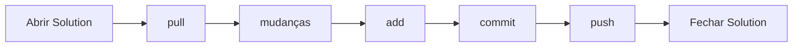

Neste artigo do [blog](https://tchuqui.github.io/) vou mostrar de maneira fácil como é possível integrar o seu projeto SSIS (SQL Server Integration Service) com engranagens de versionamento (github, gitlab, bitbucket e outros).

## O que é o GIT?

O [git](https://git-scm.com/) é um sistema de controle de versão de "código-fonte", desenvolvido para projetar programas de pequeno à grande porte com velocidade e eficiência. O git segue a linha de "código aberto", apoio da comunidade e foi desenvolvido por `Linus Torvalds`, o criador do sistema operacional [Linux](https://www.linux.org/). 

> A ferramenta é disponibilizada gratuitamente para o publico

## Versionamento

Uma ferramenta de versionamento controla cada alteração com atualizações criptografadas, salvas em um servidor formando um histórico imutável e permanente das versões. Este mecanismo é uma alternativa eficiente de backup e agilidade para o "código-fonte", evitando desastre como a perda de código entre as equipes.

> Vale ressaltar que é de fácil aprendizagem e utilização.

## SSIS (SQL Server Integration Services)

A grande vantagem de vincular o versionamento em projetos SSIS é que você pode utilizar qualquer máquina para desenvolver, não ficando dependente de estações de trabalho e servidores para avançar.

Em grandes projetos, com o **git** configurado corretamente no [**Visual Studio**](https://code.visualstudio.com/), mais de um profissional pode atuar simultaneamente em uma `solution` e aumentar com isso a produtividade da equipe.

Vale lembrar que a base dos arquivos do visual studio é o `xml`, portanto é possível versionar e desmembrar versões do seu código utilizando branchs.

Vamos lá?

Vamos considerar o Visual Studio, a feature do SSIS e o git já instalados em sua máquina para seguir com o Tutorial
{: .bubble-note}

## Tutorial

### Preparação do Gitlab

Inicialmente devemos criar um projeto na engranagem de versionamento de sua preferência. Vamos utilizar como exemplo o [gitlab](https://about.gitlab.com/)


Coloque o nome do projeto e automaticamente ele vai gerar o slug do projeto. Depois siga clicando em **Create Project**


Clique em `Code` na marcação 1 e depois copie o endereço na marcação 2


### Preparação do diretório

Crie um diretório em sua máquina com o nome "ETL_SSIS"


Clique com o botão direito do mouse na pasta ETL_SSIS e escolha a opção marcada na imagem abaixo:


Notem que um terminal do git é aberto a partir do diretório **ETL_SSIS**.


### Vincular o diretório ao Gitlab

Agora vamos fazer este diretório ter uma ligação com o projeto `importCSVtoTable` criado no **gitlab** anteriormente.

Digite no terminal

```text
git clone https://[servidor gitlab]/etl_ssis/importcsvtotable.git
```
Com este comando, o git vai versionar o repositório existente com o projeto `importCSVtoTable`, baixando todos os arquivos e criando a pasta **importcsvtotable** com inicialmente o arquivo README.md e a pasta oculta .git


### Criação do projeto no Visual Studio

Agora vamos criar um projeto SSIS no Visual Studio


no marcador 1 filtre por SSIS e depois clique **Integration Services Project**


Insira um nome para o Projeto e selecione o repositório que versionamos nos passos anteriores, depois clique em **Criar**


### Entendendo o uso do git no Visual Studio

Ao abrir o projeto e incluir um `Data Flow Task`, note que um lápis com as mudanças pendentes de "commit" aparecem com o número marcado 9 (indicando a quantidade de mudanças comparadas com a versão no final no gitlab).


Existem algumas considerações que devemos nos atentar para utilizar o Visual Studio da forma correta.

O fluxo que devemos sempre nos atentar é:



Ao tentar realizar o primeiro "commit", este erro vai aparecer na tela, pois será preciso fazer uma ação no marcador 1 (pasta oculta .vs)


Este erro ocorre porque a pasta oculta **.vs** não pode ser versionada, pois é uma pasta temporária criada pelo Visual Studio e não precisa ser salva. Para resolver temos que criar um arquivo `.gitignore` clicando no item marcado abaixo:


Note que agora o arquivo `.gitignore` foi criado no diretório versionado.


Agora precisamos incluir a pasta nova ao repositório usando o "git add" para itens novos conforme o botão abaixo:


Para finalizarmos o fluxo, depois de ter feito toda a mudança no projeto é hora de fazer o `git push`, que é onde o código vai para o Gitlab e passa a ser versionado. Para realizar esta opção é só clicar no botão mostrado abaixo:


Não se esqueça de incluir um comentário para o commit realizado!
{: .bubble-warning}

Com isso uma mensagem de êxito aparece dizendo que o código foi enviado ao "origin/master"


Agora os arquivos estão no repositório do Gitlab e podemos visualizar as branchs, commits e alterações de código.


## Explorando um pouco mais!!

Editei o projeto incluir duas ferramentas do SSIS - "Flat File Source" e um "OLE DB Destination". Depois desta inclusão notem que o lápis passa a mostrar 1 alteração e um marcador no Pacote "Package.dtsx" é assinalado.


Ao clicar no lápis, é só escrever um comentário, fazer um commit e logo depois um push, conforme o fluxo mostrado.


Logo após fazer o push, o lápis volta a apontar 0 nas alterações, ou seja, está no repositório outra mudança feita. Veja a árvore de commits logo abaixo:


Podemos agora voltar para a versão anterior caso exista algum equívoco na mudança do projeto clicando em "Exibir todas as confirmações" e clicando em Reverter para a versão escolhida.


Com isso é possível voltar para cada passo das versões do projeto, sem contar que podemos também utilizar branchs e dividir funcionalidades a serem implementadas por equipes diferentes no mesmo projeto.

Gostou da dica? 

Aventure-se!!!